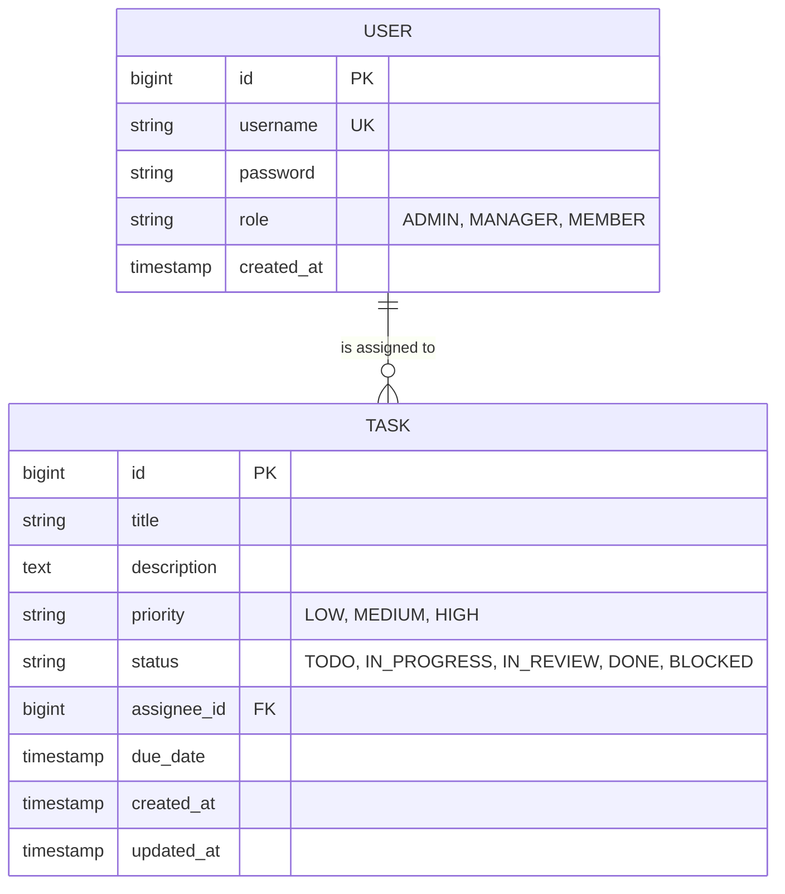

# Team Task Tracker API

A production-ready, highly secure REST API for team-based task management. Built with **Spring Boot 3**, **PostgreSQL**, and **Redis**, this application features strict Role-Based Access Control (RBAC), a robust state machine for task transitions, and an optimized caching layer.

##  Quick Start

To make the evaluation process as frictionless as possible, the `application.properties` file has been intentionally committed to this repository. You do not need to configure any environment variables manually.

**Prerequisites:** Docker (for dependencies) and Java 17+ installed.

1. **Clone the repository:**
```bash
git clone git@github.com:Devansh501/nxtwave-assignment.git
cd nxtwave-assignment.git
```

2. **Spin up the database and cache:**
Run the included docker-compose file to instantly boot PostgreSQL and Redis in the background:
```bash
docker-compose up -d
```

3. **Run the Spring Boot Application:**
You can open the project in your favorite IDE (IntelliJ/Eclipse) and run the main `NxtwaveApplication.java` class, or run it directly from the terminal using the Maven wrapper:
```bash
./mvnw spring-boot:run
```

4. **Access the API Documentation:**
Once the application starts, navigate to the Swagger UI to interact with the endpoints:
`http://localhost:8080/swagger-ui/index.html`

---

##  Database Schema

The application utilizes a normalized relational database design in PostgreSQL. 



### Schema Description
* **Users Table:** Stores authentication credentials and organizational roles. `username` is constrained as unique.
* **Tasks Table:** Stores task metadata. Contains a Foreign Key (`assignee_id`) mapping to the `Users` table. Timestamps for creation and updates are handled automatically via JPA Auditing.

---

##  Architecture & Design Decisions

### 1. Database Design: Lazy Loading & Transactional Security
To optimize memory, the `assignee` relationship inside the `Task` entity is configured with `FetchType.LAZY`. This prevents Hibernate from querying the entire User object every time a Task is loaded. 


### 2. Analytics: Raw SQL Aggregation over Application Logic
For the bonus analytics endpoint (Overdue tasks + Average completion time), I bypassed Spring Data JPA methods. Instead of loading thousands of `Task` objects into JVM memory to perform math, I wrote a native PostgreSQL query utilizing window functions (`CASE`, `EXTRACT(EPOCH)`). This offloads the heavy lifting to the database engine, ensuring the endpoint remains highly performant at scale.

### 3. Caching Strategy & Invalidation
To reduce database load for high-traffic read operations, the `GET /api/tasks` pagination endpoint is cached using **Redis**.
* **Serialization:** The caching engine uses native `JdkSerializationRedisSerializer` to serialize and deserialize complex Spring Data `Page` objects and `LocalDateTime` fields without requiring heavy custom Jackson configuration.
* **Invalidation:** The cache is aggressively invalidated using `@CacheEvict(value = "tasks", allEntries = true)`. Any time a task is created, updated, deleted, or transitions to a new state via the State Machine, the cache is wiped to prevent stale data. The TTL is also set to 60 minutes to ensure memory doesn't grow indefinitely.

### 4. Middleware RBAC Security
Security is handled at the highest level using Spring Security's `@PreAuthorize` middleware. A Member attempting an illegal action (like deleting a task) is blocked with a `403 Forbidden` response before the request ever reaches the Controller or Service layers, preventing unnecessary processing.

---

## 🔮 Future Improvements

Given more time, I would implement the following architectural enhancements:

1. **Event-Driven Architecture (WebSockets/Kafka):** I would implement the bonus real-time notification requirement by publishing state transition events to a message broker (like RabbitMQ or Kafka), which would then push SSE (Server-Sent Events) or WebSocket messages to a frontend client when a task status changes.
2. **Dedicated Auth Server:** Abstract the JWT generation and validation into a dedicated microservice to fully decouple authentication from the core business logic.
